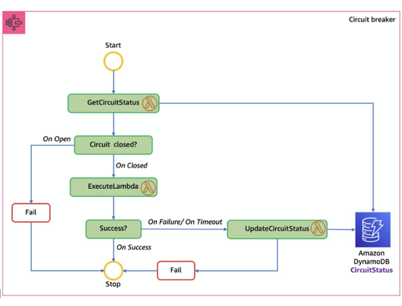

## Implementing the circuit breaker pattern using AWS Step Functions and Amazon DynamoDB

## Architecture Overview

This example uses the AWS Step Functions, AWS Lambda, and Amazon DynamoDB to implement the circuit breaker pattern:



The Step Functions workflow provides circuit breaker capabilities. When a service wants to call another service, it starts the workflow with the name of the callee service.

The workflow gets the circuit status from the CircuitStatus DynamoDB table, which stores the currently degraded services. If the CircuitStatus contains an unexpired record for the service called, then the circuit is open. The Step Functions workflow returns an immediate failure and exit with a FAIL state.

If the CircuitStatus table does not contain an item for the called service or contains an expired record, then the service is operational. The ExecuteLambda step in the state machine definition invokes the Lambda function sent through a parameter value. The Step Functions workflow exits with a SUCCESS state, if the call succeeds.

The items in the DynamoDB table have the following attributes:


*DynamoDB items list*

If the service call fails or a timeout occurs, the application retries with exponential backoff for a defined number of times. If the service call fails after the retries, the workflow inserts a record in the CircuitStatus table for the service with the CircuitStatus as OPEN, and the workflow exits with a FAIL state. Subsequent calls to the same service return an immediate failure as long as the circuit is open.

I enter the item with an associated ExpiryTimeStamp value to ensure eventual connection retries and the item expires at the defined time. The Get Circuit Status step in the state machine definition checks the service availability based on ExpiryTimeStamp value.

Expired items are deleted from the CircuitBreaker table using DynamoDB’s time to live (TTL) feature. DynamoDB’s time to live (TTL) allows you to define a per-item timestamp to determine when an item is no longer needed. I have defined the ExpiryTimeStamp as the TTL attribute.

At some point after the date and time of the ExpiryTimeStamp, typically within 48 hours, DynamoDB deletes the item from the CircuitBreaker table without consuming write throughput. DynamoDB determines the deletion time and there is no guarantee about when the deletion will occur.

Blog reference:- [https://aws.amazon.com/blogs/compute/using-the-circuit-breaker-pattern-with-aws-step-functions-and-amazon-dynamodb/](https://aws.amazon.com/blogs/compute/using-the-circuit-breaker-pattern-with-aws-step-functions-and-amazon-dynamodb/) 

## Security

See [CONTRIBUTING](CONTRIBUTING.md#security-issue-notifications) for more information.

## License

This library is licensed under the MIT-0 License. See the LICENSE file.

## Description

The Step Functions workflow provides circuit breaker capabilities. When a service wants to call another service, it starts the workflow with the name of the callee service. The workflow gets the circuit status from the CircuitStatus DynamoDB table, which stores the currently degraded services. If the CircuitStatus contains an unexpired record for the service called, then the circuit is open. The Step Functions workflow returns an immediate failure and exit with a FAIL state.

If the CircuitStatus table does not contain an item for the called service or contains an expired record, then the service is operational. The ExecuteLambda step in the state machine definition invokes the Lambda function sent through a parameter value. The Step Functions workflow exits with a SUCCESS state, if the call succeeds.

If the service call fails or a timeout occurs, the application retries with exponential backoff for a defined number of times. If the service call fails after the retries, the workflow inserts a record in the CircuitStatus table for the service with the CircuitStatus as OPEN, and the workflow exits with a FAIL state. Subsequent calls to the same service return an immediate failure as long as the circuit is open.

I enter the item with an associated **ExpiryTimeStamp** value to ensure eventual connection retries. I get the currently degraded services in *GetCircuitStatusLambda* function by querying services with ExpiryTimeStamp in the future. Services with ExpiryTimeStamp greater than current time are currently degraded and will not be retried.

```cs
var serviceDetails = _dbContext.QueryAsync<CircuitBreaker>(serviceName, QueryOperator.GreaterThan,
                new List<object>
                    {currentTimeStamp}).GetRemainingAsync();
```

### TTL feature for deleting expired items

DynamoDB's TTL feature is used to delete the expired items from the CircuitBreaker table. DynamoDB’s time to live (TTL) allows you to define a per-item timestamp to determine when an item is no longer needed. I have defined the ExpiryTimeStamp as the TTL attribute. At some point after the date and time of the ExpiryTimeStamp, typically within 48 hours, DynamoDB deletes the item from the CircuitBreaker table without consuming write throughput. DynamoDB determines the deletion time and there is no guarantee about when the deletion will occur. 


## Prerequisites

For this walkthrough, you need:

- An AWS account and an AWS user with AdministratorAccess (see the instructions on the AWS Identity and Access Management (IAM) console)
- Access to the following AWS services: AWS Lambda, AWS Step Functions, and Amazon DynamoDB.
- NET Core 6.0 SDK installed
- JetBrains Rider or Microsoft Visual Studio 2017 or later (or Visual Studio Code)

Install the AWS SAM CLI using the instructions here:

[Installing SAM](https://docs.aws.amazon.com/serverless-application-model/latest/developerguide/install-sam-cli.html)

## Setting up the environment

Use the .NET Core 3.1 code in the GitHub repository and the AWS SAM template to create the AWS resources for this walkthrough. These include IAM roles, DynamoDB table, the Step Functions workflow, and Lambda functions.

You need an AWS access key ID and secret access key to configure the AWS Command Line Interface (AWS CLI). To learn more about configuring the AWS CLI, follow these instructions.

### Step 1: Download the application

```bash
$ git clone https://github.com/aws-samples/circuit-breaker-netcore-blog.git
```

After cloning, this is the folder structure:


## Deploy using Serverless Application Model (AWS SAM)

The AWS Serverless Application Model (AWS SAM) CLI provides developers with a local tool for managing serverless applications on AWS.

1. The sam build command processes your AWS SAM template file, application code, and applicable language-specific files and dependencies. The command copies build artifacts in the format and location expected for subsequent steps in your workflow. Run these commands to process the template file:

### Step 2: Build the template

```bash
$ cd circuit-breaker
```

```bash
$ sam build
```

### Step 3: Deploy the application

```bash
$ sam deploy --guided
```


## Deploy using CDK

### Step 1: Download the application

```bash
$ git clone https://github.com/aws-samples/circuit-breaker-netcore-blog.git
```

### Step 2: Create packages of lambda functions

The Lambda functions in the circuit-breaker directory must be packaged and copied to the cdk-circuit-breaker/lambdas directory before deployment. Run these commands to process the GetCircuitStatusLambda function

```bash
cd cdk-circuit-breaker
```

```bash
mkdir lambdas
```

Now that we have created the lambdas folder, we will navigate to the circuit-breaker directory.  Once there we want to do a ls command to view the files inside the directory

GetCircuitStatusLambda		
TestCircuitBreaker		
statemachine
HelloWorld			
UpdateCircuitStatusLambda	
template.yaml

We then run these commands to package the first function: In this case "GetCircuitStatusLambda"

```bash
cd circuit-breaker/GetCiruitStatus/src/GetCircuitStatusLambda
```

```bash
$ dotnet lambda package
```

When we the function is packaged there will be a zip. and this is what you copy over to the cdk-circuit-breaker/lambdas directory.

```bash
$ cp /xxxx/xxxx/circuit-breaker-netcore-blog/circuit-breaker/GetCircuitStatusLambda/src/GetCircuitStatusLambda/bin/Release/net6.0/GetCircuitStatusLambda.zip /xxxx/xxxx/circuit-breaker-netcore-blog/cdk-circuit-breaker/lambdas
```

Repeat the same commands until all the Lambda functions in the cdk-circuit-breaker/lambdas directory.

### Step 3: Deploy the CDK code

The `cdk.json` file tells the CDK Toolkit how to execute your app. It uses the [.NET Core CLI](https://docs.microsoft.com/dotnet/articles/core/) to compile and execute your project. Build and deploy the CDK code using the commands below.

```bash
$ npm install -g aws-cdk
```

```bash
$ cd cdk-circuit-breaker/src/CdkCircuitBreaker && dotnet build
```

```bash
$ cd ../..
```

```bash
$ cdk synth
$ cdk deploy
```


## Running the service through the circuit breaker

To provide circuit breaker capabilities to the Lambda microservice, you must send the name or function ARN of the Lambda function to the Step Functions workflow:

## JSON
```
{
  "TargetLambda": "<Name or ARN of the Lambda function>"
}
```

## Successful run

To simulate a successful run, use the HelloWorld Lambda function provided by passing the name or ARN of the Lambda function the stack has created. Your input appears as follows:

## JSON
```
{
  "TargetLambda": "circuit-breaker-stack-HelloWorldFunction-pP1HNkJGugQz"
}
```

During the successful run, the Get Circuit Status step checks the circuit status against the DynamoDB table. Suppose that the circuit is CLOSED, which is indicated by zero records for that service in the DynamoDB table. In that case, the Execute Lambda step runs the Lambda function and exits the workflow successfully.


## Service timeout

To simulate a timeout, use the TestCircuitBreaker Lambda function by passing the name or ARN of the Lambda function the stack has created. Your input appears as:

## JSON
```
{
  "TargetLambda": "circuit-breaker-stack-TestCircuitBreakerFunction-mKeyyJq4BjQ7"
}
```

Again, the circuit status is checked against the DynamoDB table by the Get Circuit Status step in the workflow. The circuit is CLOSED during the first pass, and the Execute Lambda step runs the Lambda function and timeout.

The workflow retries based on the retry count and the exponential backoff values, and finally returns a timeout error. It runs the Update Circuit Status step where a record is inserted in the DynamoDB table for that service, with a predefined time-to-live value specified by TTL attribute ExpireTimeStamp.


The item in the DynamoDB table expires after 20 seconds, and the workflow retries the service again. This time, the workflow retries with exponential backoffs, and if it succeeds, the workflow exits successfully.

## Cleaning up

To avoid incurring additional charges, clean up all the created resources. Run the following command from a terminal window. This command deletes the created resources that are part of this example.

```bash
sam delete --stack-name circuit-breaker-stack --region <region name>
```

This lab showed how to implement the circuit breaker pattern using Step Functions, Lambda, DynamoDB and .Net Core 6.0.  This pattern can help prevent system degradation in service failures or timeouts.


